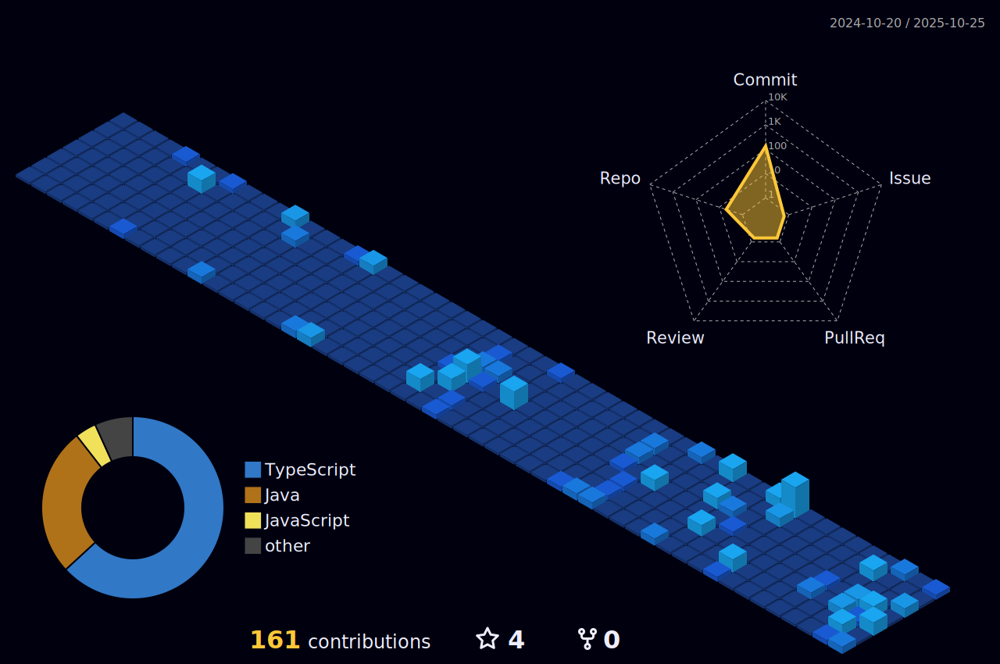

|  |  |
| ----------------------------------------------------------------------------------------------------------------------------------------------------------------------------------------------------- | ---------------------------------------------------------------------------------------------------------------------------------------------------------------------------------------- |

  
    

 
   
    <h2> Thanks!</h2>
